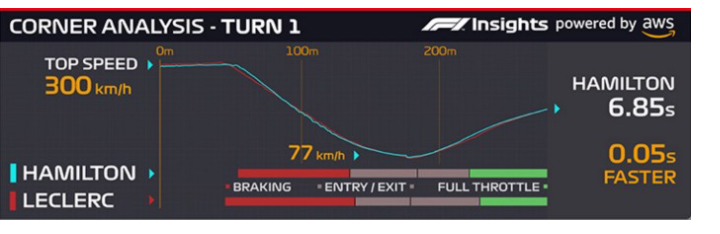
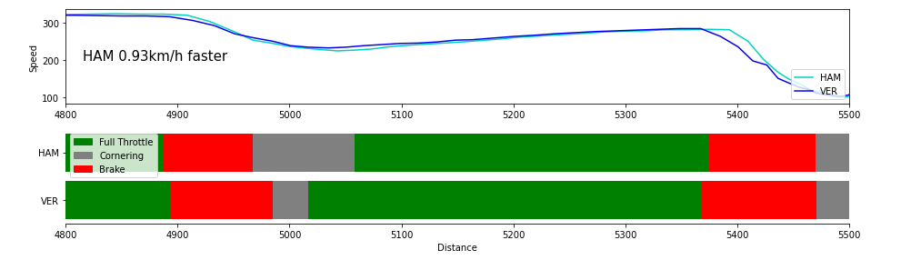

# Details
This repo focuses on recreating AWS Corner Insights used in F1 broadcasts. It uses the FastF1 Api. 

Documentation for the fastf1 library can be found here:https://theoehrly.github.io/Fast-F1/index.html  

Inspired by this medium article: https://medium.com/towards-formula-1-analysis/how-to-recreate-the-formula-1-aws-corner-analysis-in-python-37c26363c47b 

AWS corner Analysis compares the Braking, Cornering and Throttle controls of drivers as they go through corners. 
Using the FastF1 API, this analysis can be re-created. 

This notebook compares the corner behaviour of Hamilton and Verstappen during the 2021 British GP Qualifying. 

This can however be modified to any drivers and any sessions.  

## Inspiration from Amazon Insights

## Output
